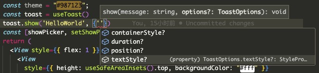

# expo-toast

> `react-native`搞了这么多年，没有一个既简单又实用的`toast`。


不是过了好多年没人维护，各种报错，就是`issues`已读不关，再就是`props`封装的乱七八糟。

那么问题来了，`react-native`的大旗谁来扛？

一行代码直接梭哈 ...

```js
const toast = useToast();
toast.show("HelloWorld.");
```

什么？想自定义样式？



完全原生的样式，会`View`和`Text`，就会自定义样式。

## 原理

本质上就是在根节点注入一个`View`，和所有的页面同一级，然后想办法在子页面的任何地方都能显示这个`View`。

### DeviceEmitter

设备监听，这个是最直接，感觉也是最傻的方法。因为要监听一个事件，就要每次发消息，所以发消息还要再做一次封装。性能有没有问题不知道，太菜了。

### Provider

这也就是这个库用的方式，像很多的状态管理库，都是根节点注入`SomeStoreProvider`，然后全局任何地方都能访问这个`store`。

所以这也就是我换了个思路，搞了一个`ToastProvider`。

## 使用

在项目的入口，注入`ToastProvider`。

- react-native

  - /index.js

- expo

  - /app/\_layout.tsx

```js
import { ToastProvider } from "expo-toast";
```

```js
return (
  <ToastProvider>
    {/* ... Other Provider */}
    {/* App.tsx */}
    {/* ... */}
  </ToastProvider>
);
```

## 不足之处

- 多个消息的队列处理，像`antd`的`toast`一样，可以以队列的形式，一直叠加展示。

- 要自己写`waring`、`success`、`info`的样式，不过这也不重要，自己再封装一下，`options`里面丢几个颜色进去就好（:手动吃瓜）。

## Props

没啥好介绍的：

### position

位置，POSITION.POSITOP | POSITION.BOTTON

### duration

毫秒数，想弹多久弹多久。

### containerStyle

样式，和`View`的样式一样，用的就是`ViewStyle`。

### textStyle

内容样式，和`Text`的样式一样，用的就是`TextStyle`。
